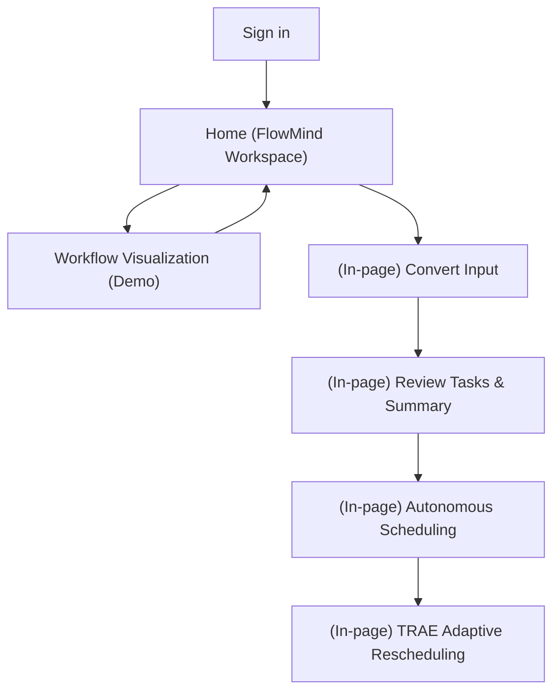

## 1. Product Overview
FlowMind AI turns messy, unstructured input into clear tasks and summaries, then schedules work automatically.
It continuously adapts your plan using TRAE (adaptive rescheduling) and provides a demo workflow visualization.

## 2. Core Features

### 2.1 User Roles
| Role | Registration Method | Core Permissions |
|------|---------------------|------------------|
| Guest (Demo) | No registration | Can try sample input, view demo workflow visualization; no persistence |
| Signed-in User | Email + password (Supabase Auth) | Can save tasks/summaries, run scheduling/rescheduling, view run history |

### 2.2 Feature Module
Our requirements consist of the following main pages:
1. **Home (FlowMind Workspace)**: messy input capture, AI-to-tasks/summaries output, task list, autonomous scheduling, TRAE adaptive rescheduling, run history.
2. **Workflow Visualization (Demo)**: interactive graph of “input → parse → tasks/summaries → schedule → TRAE reschedule,” with run playback.
3. **Sign in**: login/sign up, password reset.

### 2.3 Page Details
| Page Name | Module Name | Feature description |
|-----------|-------------|------------------|
| Home (FlowMind Workspace) | Top navigation | Switch between Workspace and Workflow Demo; show user state (Guest/Signed-in) |
| Home (FlowMind Workspace) | Messy input capture | Paste/type free-form notes; load sample input; submit to convert |
| Home (FlowMind Workspace) | Tasks & summaries output | Display extracted tasks (title, notes, estimate, due); display generated summary; allow copy/export |
| Home (FlowMind Workspace) | Task inbox & editing | Create/update/complete tasks; adjust priority/estimate/due; bulk accept/reject extracted tasks |
| Home (FlowMind Workspace) | Autonomous scheduling | Generate a schedule from tasks using working hours + constraints; show time blocks on a timeline |
| Home (FlowMind Workspace) | TRAE adaptive rescheduling | Recompute schedule when tasks change (done/added/overdue), conflicts occur, or user “Reschedule” triggers; highlight deltas |
| Home (FlowMind Workspace) | Run history | Save each conversion/scheduling run; allow reopen to compare results |
| Workflow Visualization (Demo) | Workflow graph | Show nodes/edges of the pipeline; click nodes to see inputs/outputs; zoom/pan/reset |
| Workflow Visualization (Demo) | Run playback | Step through a recorded run; show intermediate artifacts (parsed entities, tasks, schedule, reschedule) |
| Sign in | Authentication | Sign in/sign up; password reset; redirect back to Workspace |

## 3. Core Process
**Guest (Demo) Flow**: You open the Workspace, paste text (or load a sample), and click Convert. FlowMind produces tasks + a summary, then generates an initial schedule. You can trigger TRAE Reschedule to see how the plan adapts. You can open the Workflow Demo to visualize the pipeline.

**Signed-in User Flow**: You sign in, submit messy input, review/accept extracted tasks, and run autonomous scheduling. As you complete tasks or edit constraints, TRAE recalculates and shows what moved. Runs are saved for later review.

