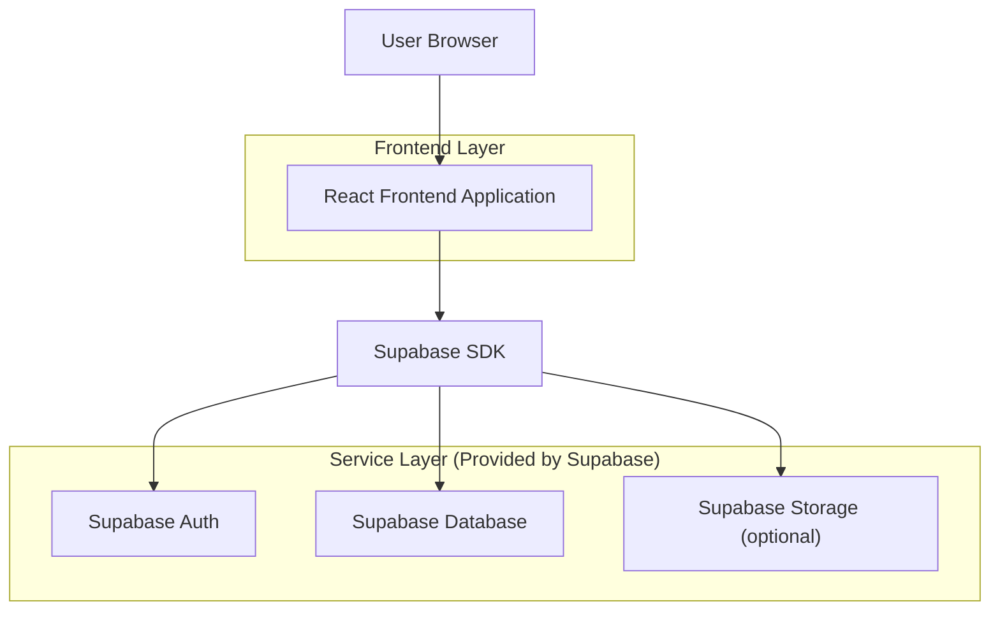
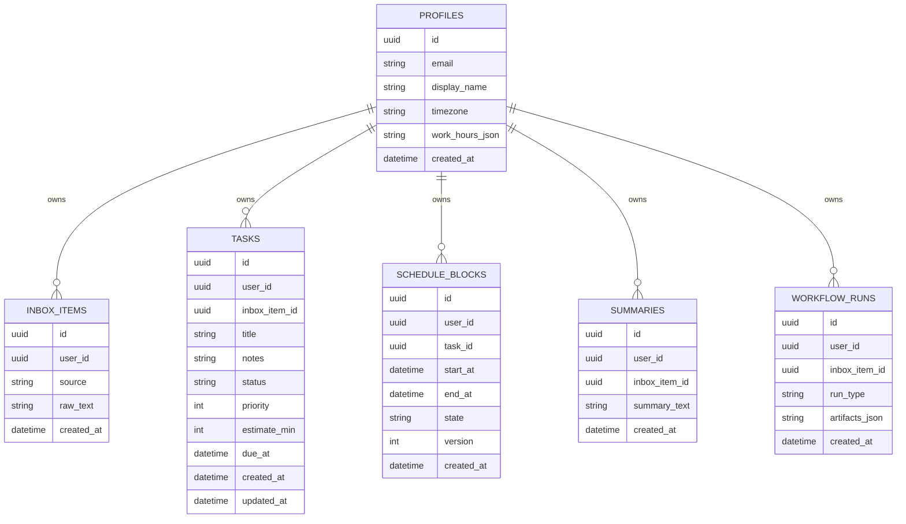

## 1.Architecture design


## 2.Technology Description
- Frontend: React@18 + TypeScript + vite + tailwindcss@3 + react-router
- State/UI: Zustand (or React Context) + react-hook-form
- Visualization: Mermaid (render) and/or React Flow (interactive graph)
- Backend: Supabase (Auth + Postgres + optional Storage)

## 3.Route definitions
| Route | Purpose |
|-------|---------|
| / | Home workspace: input → tasks/summaries → schedule → TRAE reschedule |
| /workflow | Workflow visualization demo + run playback |
| /auth | Sign in / sign up / reset password |

## 6.Data model(if applicable)

### 6.1 Data model definition


### 6.2 Data Definition Language
Profiles (profiles)
```sql
CREATE TABLE profiles (
  id UUID PRIMARY KEY,
  email TEXT,
  display_name TEXT,
  timezone TEXT DEFAULT 'UTC',
  work_hours_json JSONB DEFAULT '{}'::jsonb,
  created_at TIMESTAMPTZ DEFAULT now()
);

CREATE TABLE inbox_items (
  id UUID PRIMARY KEY DEFAULT gen_random_uuid(),
  user_id UUID NOT NULL,
  source TEXT DEFAULT 'paste',
  raw_text TEXT NOT NULL,
  created_at TIMESTAMPTZ DEFAULT now()
);
CREATE INDEX idx_inbox_user_created ON inbox_items(user_id, created_at DESC);

CREATE TABLE tasks (
  id UUID PRIMARY KEY DEFAULT gen_random_uuid(),
  user_id UUID NOT NULL,
  inbox_item_id UUID,
  title TEXT NOT NULL,
  notes TEXT,
  status TEXT DEFAULT 'open',
  priority INT DEFAULT 3,
  estimate_min INT,
  due_at TIMESTAMPTZ,
  created_at TIMESTAMPTZ DEFAULT now(),
  updated_at TIMESTAMPTZ DEFAULT now()
);
CREATE INDEX idx_tasks_user_status ON tasks(user_id, status);

CREATE TABLE schedule_blocks (
  id UUID PRIMARY KEY DEFAULT gen_random_uuid(),
  user_id UUID NOT NULL,
  task_id UUID,
  start_at TIMESTAMPTZ NOT NULL,
  end_at TIMESTAMPTZ NOT NULL,
  state TEXT DEFAULT 'planned',
  version INT DEFAULT 1,
  created_at TIMESTAMPTZ DEFAULT now()
);
CREATE INDEX idx_sched_user_start ON schedule_blocks(user_id, start_at);

CREATE TABLE summaries (
  id UUID PRIMARY KEY DEFAULT gen_random_uuid(),
  user_id UUID NOT NULL,
  inbox_item_id UUID,
  summary_text TEXT NOT NULL,
  created_at TIMESTAMPTZ DEFAULT now()
);

CREATE TABLE workflow_runs (
  id UUID PRIMARY KEY DEFAULT gen_random_uuid(),
  user_id UUID NOT NULL,
  inbox_item_id UUID,
  run_type TEXT NOT NULL,
  artifacts_json JSONB DEFAULT '{}'::jsonb,
  created_at TIMESTAMPTZ DEFAULT now()
);
```

Access (baseline; refine with RLS policies later)
```sql
GRANT SELECT ON profiles, inbox_items, tasks, schedule_blocks, summaries, workflow_runs TO anon;
GRANT ALL PRIVILEGES ON profiles, inbox_items, tasks, schedule_blocks, summaries, workflow_runs TO authenticated;
```
