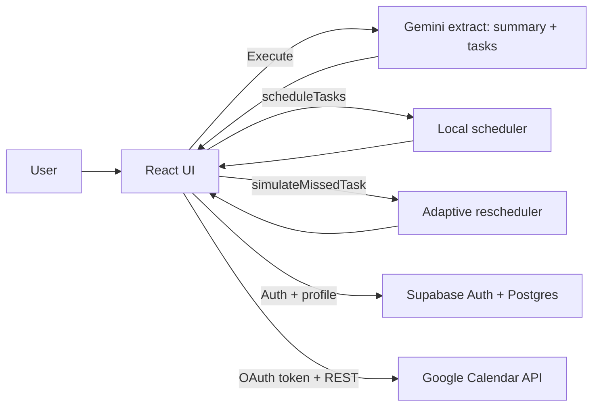

# Planify (FlowMind AI)

Planify is a FlowMind-style “execution agent” UI: paste messy notes → the AI extracts structured tasks + a summary → Planify auto-schedules those tasks into your availability and can adapt when you miss something.

This repo is a demo-grade, frontend-first implementation that emphasizes:
- Turning unstructured input into structured execution artifacts
- Autonomous scheduling inside realistic working hours
- Adaptive rescheduling (“simulate missed task”) to show agent-like behavior
- Optional integrations: Supabase (auth + availability persistence) and Google Calendar (two-way-ish sync)

## What You Can Demo (Judging Flow)

1. Sign in (Supabase).
2. Paste this into **Smart Input**:

   ```
   Assignment due Friday, meeting at 5 PM, study ML chapter 3
   ```

3. Click **Execute**.
4. Observe:
   - **AI Summary** (short summary + key insights)
   - **Active Tasks** populated and scheduled into time slots
   - **Adaptive AI Engine** stepper animating through extraction → scheduling → done
5. Click **Simulate Miss** on a task:
   - The task becomes **Missed**
   - Planify creates a **Rescheduled** task in the next available slot (or asks for a manual decision for fixed-time commitments like “exam”, “interview”, etc.)
6. (Optional) Connect Google Calendar:
   - Tasks with scheduled times automatically create Google Calendar events
   - Event updates / deletions are synced based on a private `planifyTaskId` field

## Architecture (Deep Overview)

At a high level, Planify is a React + Vite app with three “brains”:
- Gemini: NLP extraction (summary + tasks)
- A local scheduler/rescheduler: fits tasks into availability and avoids conflicts
- Integrations: Supabase for auth + saving availability, Google Calendar for event sync



### Core Data Flow

- Input is submitted in [InputPanel.tsx](file:///c:/github/Planify/src/components/InputPanel.tsx).
- The Gemini call lives in [ai.ts](file:///c:/github/Planify/src/services/ai.ts) and returns strict JSON (`summary` + `tasks`).
- Scheduling/rescheduling logic lives in [AppContext.tsx](file:///c:/github/Planify/src/context/AppContext.tsx):
  - `processNewInput()` appends new tasks and computes their initial time slots
  - `scheduleTasks()` finds the next valid gap inside your availability window (15-minute granularity) and avoids collisions
  - `simulateMissedTask()` marks a task as missed and re-schedules it (or flags it for manual decision when it looks like a fixed-time commitment)
- UI is composed in [Dashboard.tsx](file:///c:/github/Planify/src/components/Dashboard.tsx) into:
  - Input + Summary (left)
  - Workflow stepper + Tasks (middle)
  - Google Calendar panel (right)

### “TRAE” / Agent Behavior in This Repo

This project models an autonomous workflow with explicit “steps” (Idle → Extracting → Scheduling → Done) via `workflowStep` in [AppContext.tsx](file:///c:/github/Planify/src/context/AppContext.tsx). The UI stepper in [WorkflowVisualizer.tsx](file:///c:/github/Planify/src/components/WorkflowVisualizer.tsx) makes the pipeline visible during demos.

The “adaptive” moment is implemented by `simulateMissedTask()`:
- It changes state, logs a history event, and triggers a replan.
- If the task text implies a fixed-time event (“exam”, “interview”, “appointment”, etc.), it deliberately does not auto-reschedule and prompts for a user decision.

### Persistence Model

- Tasks, summary, and history are persisted locally in the browser (`localStorage`) so the demo survives refreshes.
- Availability is stored in Supabase (table: `profiles.availability`) so it follows the user across devices.

## Repository Layout

```
src/
  components/            UI building blocks (Dashboard, InputPanel, TaskView, GoogleCalendarView, ...)
  context/               Global app state + scheduling engine (AppContext)
  lib/                   Supabase client + small utilities
  services/              External service calls (Gemini extraction)
  App.tsx                App entry and auth/onboarding gating
```

Key files to read first:
- [App.tsx](file:///c:/github/Planify/src/App.tsx): routing-by-state (Auth → Onboarding → Dashboard)
- [AppContext.tsx](file:///c:/github/Planify/src/context/AppContext.tsx): scheduling + rescheduling + persistence
- [ai.ts](file:///c:/github/Planify/src/services/ai.ts): Gemini prompt + JSON schema
- [GoogleCalendarView.tsx](file:///c:/github/Planify/src/components/GoogleCalendarView.tsx): Google OAuth + Calendar sync
- [supabase.ts](file:///c:/github/Planify/src/lib/supabase.ts): Supabase client bootstrap

## Running Locally

### Prerequisites

- Node.js (recommended: Node 18+)
- A Supabase project (required for auth + onboarding)
- A Gemini API key (required for AI extraction)

### 1) Install

```bash
npm install
```

### 2) Configure environment

Copy `.env.example` to `.env` and fill the variables you need:

```bash
# Required for AI extraction
GEMINI_API_KEY=...

# Required for auth + onboarding
VITE_SUPABASE_URL=https://xxxxx.supabase.co
VITE_SUPABASE_ANON_KEY=...

# Optional (Google Calendar panel)
VITE_GOOGLE_CLIENT_ID=your-client-id.apps.googleusercontent.com
```

### 3) Create Supabase schema

Run this SQL in the Supabase SQL editor:
- [supabase-setup.sql](file:///c:/github/Planify/supabase-setup.sql)

This creates:
- `public.profiles (id, availability, created_at)`
- RLS policies that only allow users to read/write their own profile

### 4) Configure Supabase Auth

In Supabase:
- Enable Email/Password auth (if you want basic sign-in)
- Enable Google provider (if you want “Continue with Google” on the sign-in page)
- Add redirect URLs:
  - `http://localhost:3000/auth/callback.html`
  - Your deployed URL + `/auth/callback.html`

### 5) Start dev server

```bash
npm run dev
```

Open:
- `http://localhost:3000`

## Google Calendar Integration (Optional)

The Google Calendar panel uses Google Identity Services (token flow) and then calls the Calendar REST API directly from the browser. It stores the access token in `localStorage` with a TTL.

Setup steps:
1. In Google Cloud Console, enable **Google Calendar API**.
2. Create an OAuth 2.0 Client ID of type **Web application**.
3. Add authorized JavaScript origins:
   - `http://localhost:3000`
   - Your deployed origin
4. Add authorized redirect URIs (needed by Google Identity Services in some environments):
   - `http://localhost:3000`
5. Add to `.env`:

   ```
   VITE_GOOGLE_CLIENT_ID=your-client-id.apps.googleusercontent.com
   ```

In the UI:
- Click **Connect your Google account**
- New scheduled tasks are auto-created as Calendar events

## Scripts

```bash
npm run dev      # Start Vite dev server on http://localhost:3000
npm run build    # Production build to dist/
npm run preview  # Preview production build
npm run lint     # Typecheck (tsc --noEmit)
```

## Security Notes (Important)

This project is demo-oriented. For production use, you must redesign these pieces:

- Gemini API key exposure:
  - The current setup injects `GEMINI_API_KEY` into the frontend bundle via [vite.config.ts](file:///c:/github/Planify/vite.config.ts).
  - That means anyone who can load the app can extract the key from the built JavaScript.
  - Production fix: move Gemini calls to a backend (server/API route) and keep secrets server-side.
- Google access token storage:
  - Tokens are stored in `localStorage` for convenience. Production fix: consider more robust session handling.
- Supabase RLS:
  - RLS exists for `profiles`, but there are no tables for tasks/runs yet. If you add persistence, keep RLS on by default.

## Troubleshooting

- “Invalid URL” / auth calls failing:
  - Ensure `VITE_SUPABASE_URL` and `VITE_SUPABASE_ANON_KEY` are set and restart the dev server.
- Google Calendar “redirect_uri_mismatch”:
  - Add the exact origin (`http://localhost:3000`) to Authorized JavaScript origins in Google Cloud.
- Google token expires / events stop loading:
  - Reconnect in the Calendar panel (token TTL is intentionally short for demo).
- AI extraction returns invalid JSON:
  - Confirm `GEMINI_API_KEY` is valid and that the selected Gemini model is available for your account.

## Roadmap Ideas

- Server-side AI proxy (remove client-side secrets)
- True workflow graph playback (node-by-node artifacts)
- Persistent tasks/schedules in Supabase with full RLS
- More robust scheduling constraints (hard deadlines, splitting long tasks, breaks, focus modes)
